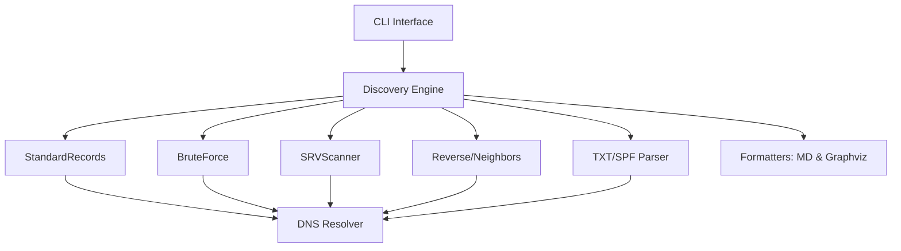

```mermaid
    graph TD
    CLI[CLI Interface] --> Engine[Discovery Engine]
    Engine --> S1[StandardRecords]
    Engine --> S2[BruteForce]
    Engine --> S3[SRVScanner]
    Engine --> S4[Reverse/Neighbors]
    Engine --> S5[TXT/SPF Parser]
    S1 & S2 & S3 & S4 & S5 --> Resolver[DNS Resolver]
    Engine --> Formatters[Formatters: MD & Graphviz]
```